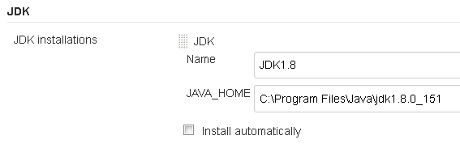
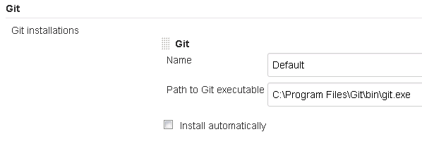
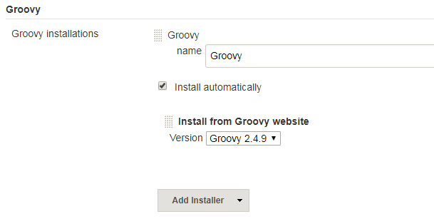
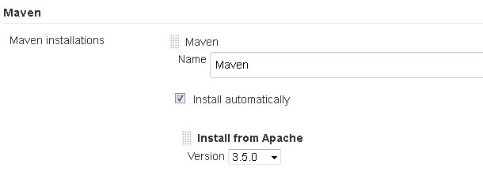
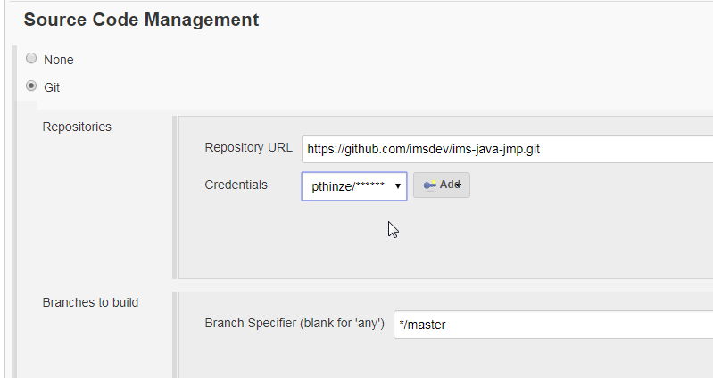
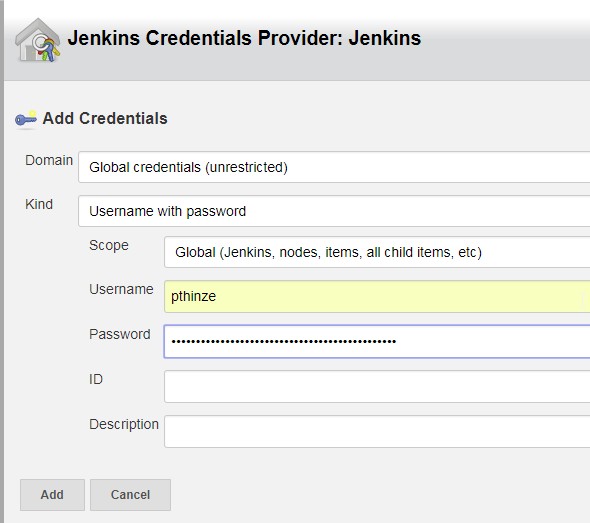
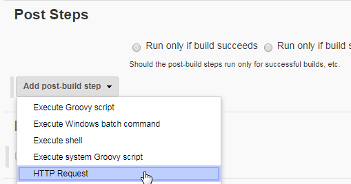

# Jenkins for continous integration and delivery

## Deliver a Java application to IMS using open source tools

In this demo Jenkins is used with GitHub, Maven, Rest, and [z/OSMF](https://www.ibm.com/support/knowledgecenter/en/SSLTBW_2.2.0/com.ibm.zos.v2r2.izua300/IZUHPINFO_OverviewMain.htm) to automate the software development process for an IMS application. 

What has tradionally been manual hand-offs between development, build, test, staging, and production, can be automated with Jenkins to accelerate the delivery of value to clients.

The scenario includes a developer commiting code to a Git staging repository. Once the code has been commited Jenkins will compile and build the source and then FTP the jar file to z/OS. Upon competion of this step Jenkins will create and start a z/OSMF workflow to enable a Java Messaging Proccessig (JMP) on z/OS.  

For a blog post about DevOps with IMS see [DevOps and IMS: Getting Started](https://developer.ibm.com/zsystems/2018/02/20/devops-ims-getting-started)
 
### Use Jenkins to .. 
  * Build a Java project from GitHub and deploy to IMS
  * Set up and start a Java JMP region

## z/OS Prerequisites
  * An SMP/E installation of IMS is done and the IMS load libraries are available.
  * Identify the z/OS system parameters.
  * IMS SVC modules are installed on the system.
  * The Common Service Layer must be started.
  * z/OSMF must be started. Both the angel and server z/OSMF address spaces must be started. 
  * The IMS catalog has been enabled.

## z/OS Security requirements  
To run the workflow, you need the following authority:
* RACF READ authority on SMP/E-installed IMS libraries.
* RACF UPDATE authority on the high-level qualifiers (HLQs) you are using for the IMS instance libraries.
* Authority to ADD or DELETE APF authorizations.

## Workstation prerequsites
* 256 MB of RAM and 1 GB of hard drive space
* Latest LTS version of [Jenkins](https://jenkins.io/download)
* Latest version of [Java 8](http://www.oracle.com/technetwork/java/javase/downloads/jdk8-downloads-2133151.html)
* Latest version of [Git](https://git-scm.com/downloads)
* Apache Maven 3.5.0 (optional)

## Install Git and Jenkins
  * Download [Git](https://git-scm.com/downloads) and install the latest version with the default settings.
  * Download [Jenkins](https://jenkins.io/download), selecting the LTS version on the left of the page, for the specific platform
    * For Windows, 
        Unzip the archive folder and double-click the MSI installer and accept the defaults.     
  * After the Jenkins installation, your web browser will open to `http://localhost:8080`
  * Complete the installation process by **Unlocking Jenkins** with the Administrator password specified at the given location.
  * On the next page click **Install suggested plugins** to complete the installation. (~3 minutes)
  * **Create First Admin User**
  * **Save and Finish**
  * **Start using Jenkins**

## Jenkins configuration

### Install custom plugins

Now we will install the plugins needed to automate the build and delivery process

  * In the Jenkins web interface select Manage Jenkins -> Manage plugins -> Available
  * Locate and select the following plugins: (you may want to use the Find tool in the web browser)
    * Maven Integration plugin - Used to build and compile Maven projects
    * HTTP Request Plugin - Used to send HTTP JSON requests to z/OS to creata a workflow
    * Groovy - A scripting language to process the create workflow response and extract a workflow key needed to start the workflow
    * Environment Injector Plugin - Used to save the workflow key to an environment variable

At the very bottom of the plugins page, select:
   * **Download now and install after restart**
   * On the next page click **Restart Jenkins when installation is complete and no jobs are running** (~2 minutes)

If the browser seems to hang you can refresh the page if needed and it will pickup where it left off.

### Configure Java and the installed plugins

Now we will configure Java and the plugins that were installed.  

In the Jenkins GUI select: Manage Jenkins -> Global Tool Configuration:
* Under JDK click **Add JDK**
   * Set the name of the JDK, i.e JDK1.8
   * Set the **JAVA_HOME** value (path of the Java JDK) i.e "C:\Program Files\Java8"
   * Uncheck **Install automatically**
   
  
   
* Under Git set **Path to Git executable** to the location .. where the `Git\bin`  installed  (i.e: "C:\Program Files\Git\bin\git.exe").

  

* Under Groovy, click **Add Groovy**
* Set the Name to "Groovy". 
* Keep the Install automatically checked. Optionally, you can specify your local Groovy installation. 

  

* Under Maven click **Add Maven**
* Set the Name to "Maven". 
* Keep the **Install automatically** checked. Optionally, you can specify your local Maven installation. 

  

To finish click Save button.

Next we will create a Maven project which will build a Java jar from a GitHub repository and deploy it to IMS, starting a JMP.

## Create a Maven Project

  * On the Jenkins main GUI select "New Item"
  * Fill in the name of the project and select Maven Project
  * Select Okay

The following page is the job configuration page where we will set up Git, the build, and the post build steps to build and deploy the Java application to IMS.

For this setup we will use an existing repository: https://github.com/imsdev/ims-java-jmp.git.  This repository contains two Maven projects which are Java JMP IMS applications.  We will deploy the insurancenodb Maven project to IMS. 

A second repository, https://github.com/imsdev/ims-devops-imsjava, contains the deployJavaToIMS.xml workflow for automating the set up of Java and the JMP on z/OS.  Please view the Readme there for how to set up the workflow on z/OS. 

Under "Source Code Management"
  * Select Git and enter the GitHub Repository URL" https://github.com/imsdev/ims-java-jmp.git
  
    

  * You may need to add your Git credentials into Jenkins. Find the Add button with the key icon. 
  * Click Add -> Jenkins and enter your GitHub username and password
  
    

  * Note: If you are having issues with authentication, generate a token to use instead of a password. See the reference here. https://github.com/settings/tokens

Under Build
  * Set Root POM to the directory of your pom.xml: insurancenodb/pom.xml
  * Set Goals and options to "clean compile install"
  
  

The "Root POM" field points to "{Jenkins Installation Location}/workspace/{Name of Project}". By specifying "insurancenodb/pom.xml" you are pointing to the pom.xml that will be located at 
`{Jenkins Installation Locaiton}/workspace/insurancenodb/insurancenodb/pom.xml`
when the clone of the repository occurs.

When the build occurs later it will create the jar file with the name insurancenodb-1.jar

### Set up an HTTP request POST method to create a z/OSMF workflow
Under "Post Steps"
  * Add post-build step -> HTTP Request. 
  
  

  * And then select "Advanced..."
  * Set URL to the URL of your z/OSMF server and the workflows rest destination:
    ```
    https://myzosmfdomain.com/zosmf/workflow/rest/1.0/workflows`
    ```
  * Change HTTP mode to POST
  
  

  * Set Headers Content-type to APPLICATION JSON
  * Add a Custom header and set Header to Authorization
  * Set Value to "Basic <base 64 encoding of your user id and password>" 
    * For example, `Basic eW91aGF2ZTp0b29tdWNodGltZQ==`

  

z/OSMF Basic Auentication requires your system user ID and password to be encoded to Base 64.
The text you want to encode should be in this format:
`userid:password`

For example

```
john:loveims
```

You can use the following website to encode/decode: https://www.base64encode.org/
For More information on [authorization](https://www.ibm.com/support/knowledgecenter/en/SSLTBW_2.3.0/com.ibm.zos.v2r3.izua700/IZUHPINFO_RESTServices.htm) visit KC

For information about setting up SSL with Jenkins see [Authentication](https://github.com/imsdev/share2018/wiki/Authentication) at the wiki.

  * Set Request body to your workflow parameters. 
```  
{
    "workflowName":"DeployJavaToIMS",
    "workflowDefinitionFile":"/u/paul/workflows/java/deployJavaToIMS.xml",
    "variableInputFile":"/u/paul/workflows/java/java_workflow_variables.properties",
    "variables":[{"name":"DFS_classpath","value":"/u/paul/java/ims14/target/insurancenodb-1.jar"}],
    "system":"STLABE1",
    "owner":"paul",
    "assignToOwner":true,
    "accessType": "Public"
}
```

  

* Set Output response to file to "createWorkflowResponse.txt" to save the HTTP output
* "Set Response body in console" to Yes in order to view the response returned from z/OSMF

  

More [resources](https://www.ibm.com/support/knowledgecenter/en/SSLTBW_2.3.0/com.ibm.zos.v2r3.izua700/izuprog_API_WorkflowServices.htm) to create and start your personalized request body.

### Set up an HTTP request PUT method to start the z/OSMF workflow
#### Create a Groovy script
This step parses the HTTP response output from the previous create workflow step. It extracts the workflow key id from the response body and saves it to a file to be used for starting the z/OSMF workflow.

* Add post-build step -> **Execute system Groovy script**
* Set Groovy script to the script below. 
``` 
import groovy.json.JsonSlurper
def workspace = build.getEnvVars()["WORKSPACE"]
def json = new JsonSlurper().parse(new FileReader("$workspace/createWorkflowResponse.txt"))
def workflowKeyFile = new File("$workspace/workflowKey.txt")
workflowKeyFile.text = "workflowKey=" + json.workflowKey
```
  

#### Inject environment variables
This step saves the contents of the workflowKey.txt as enviornment variable which we can call in the next step as part of the HTTP request to start the created z/OSMF workflow. 

For example:
workflowKey=2429c266-e8c3-498d-8a4b-4d306a315d31

* Add post-build step -> **Inject environment variables**
* Set **Project File Path** to "$WORKSPACE/workflowKey.txt"

  

#### Start workflow set up
In this step we are using the $workflowKey environment variable created in the prior step

* Add post-build step -> **HTTP Request and expand Advanced**
* Set the **URL** to the z/OSMF URL required to start the workflow

  ```
  https://myzosmfdomain.com/zosmf/workflow/rest/1.0/workflows/${workflowKey}/operations/start
  ```
  
    

* Change **HTTP** mode to **PUT**
* Add a **Custom header** and set Header to **Authorization**
* Set **Value** to "Basic <base 64 encoding of your user id and password>" which is the same as above


* Set **Response body in console?** to **Yes** in order to view the response returned from zosmf
